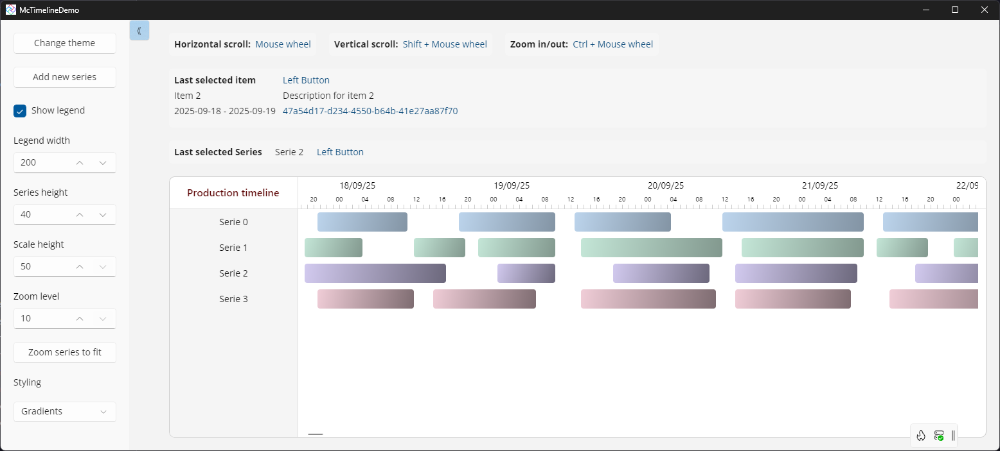

# McTimeline

 
[](https://www.nuget.org/packages/McTimeline/)

`McTimeline` is a reusable Uno/WinUI timeline control for rendering time-based items grouped by series.

It is implemented as a multi-targeted class library in `src/McTimeline/McTimeline.csproj` and currently targets:

- `net10.0`
- `net10.0-desktop`
- `net10.0-windows10.0.26100`
- `net10.0-browserwasm`
- `net10.0-android`
- `net10.0-ios`

</br>



## Current capabilities

- Canvas-based timeline rendering with virtualized viewport math (`McTimelineViewport`, `McVirtualTimeAxis`, `McVirtualSeriesAxis`)
- Multi-series model with per-series style override (`McTimelineSeries.SeriesStyle`)
- Day and hour scale rendering with adaptive hour label density based on zoom
- Scroll and zoom interaction on pointer wheel:
- `Ctrl + Wheel`: horizontal zoom (pixels-per-hour)
- `Wheel`: horizontal timeline scroll
- `Shift + Wheel`: vertical series scroll
- Anchor-preserving zoom around mouse position
- Legend panel (show/hide, configurable width, caption)
- Click events for both timeline items and legend series, including pointer button info
- Runtime style customization through dependency properties and resource dictionaries
- Custom timeline bar type support via `TimelineBarType` (`ITimelineBar` + `FrameworkElement`)
- Public refresh and fit APIs:
- `Refresh()`
- `ZoomSeriesToFit()`

## Repository structure

- `src/McTimeline/`: reusable control library
- `src/McTimelineDemo/`: Uno demo app with live configuration panel and style presets
- `src/Timeline.Tests/`: unit tests for viewport and axis logic
- `src/CanvasTest/`: additional rendering/viewport experiments

## Quick start

1. Reference `src/McTimeline/McTimeline.csproj` from your app.
2. Add the namespace in XAML: `xmlns:mctl="using:McTimeline"`.
3. Bind your data and range.

```xaml
<Page
    xmlns="http://schemas.microsoft.com/winfx/2006/xaml/presentation"
    xmlns:x="http://schemas.microsoft.com/winfx/2006/xaml"
    xmlns:mctl="using:McTimeline">

    <mctl:McTimeline
        SeriesCollection="{x:Bind ViewModel.Series, Mode=OneWay}"
        MinDate="{x:Bind ViewModel.DataInici, Mode=OneWay}"
        MaxDate="{x:Bind ViewModel.DataFinal, Mode=OneWay}"
        SeriesHeight="{x:Bind ViewModel.SeriesHeight, Mode=OneWay}"
        ScaleHeight="{x:Bind ViewModel.ScaleHeight, Mode=OneWay}"
        LegendWidth="{x:Bind ViewModel.LegendWidth, Mode=OneWay}"
        PixelsPerHour="{x:Bind ViewModel.PixelsPerHour, Mode=TwoWay}" />
</Page>
```

## Data model

- `McTimelineSeriesCollection`: collection of timeline series
- `McTimelineSeries`:
- `Title`
- `Items` (`ObservableCollection<McTimelineItem>`)
- `SeriesStyle` (optional per-series style)
- helper methods: `Add`, `Remove`, `Clear`, `Sort`, `SortDescending`
- `McTimelineItem`:
- `IdKey`, `Title`, `Description`
- `Start`, `End`
- `Visible`, `Selected`

## Public API highlights

### Events

- `ItemClicked` (`McTimelineItemClickedEventArgs`)
- `SeriesClicked` (`McTimelineSeriesClickedEventArgs`)

Both event args include:

- clicked entity (`Item` or `Series`)
- `SeriesIndex`
- pointer button (`McTimelinePointerButton`: `Left`, `Right`, `Middle`, `X1`, `X2`)

### Key dependency properties

- data and range:
- `SeriesCollection`
- `MinDate`, `MaxDate`
- layout and zoom:
- `PixelsPerHour` (clamped to `[10, 300]`)
- `SeriesHeight`
- `ScaleHeight`
- `LegendWidth`
- legend:
- `IsLegendVisible`
- `LegendCaption`
- styling:
- `TimeScaleStyle`
- `TimeScaleTextStyle`
- `TimeScaleTickStyle`
- `LegendStyle`
- `LegendCaptionStyle`
- `LegendItemStyle`
- `TimelineScrollStyle`
- `TimelineCanvasStyle`
- `TimelineItemStyle`
- `LegendItemTemplate`
- extensibility:
- `TimelineBarType`

## Styling and theming

The control ships theme-aware resources in:

- `src/McTimeline/Themes/McTimelineResources.xaml`
- `src/McTimeline/Themes/ThemeResources.Light.xaml`
- `src/McTimeline/Themes/ThemeResources.Dark.xaml`
- `src/McTimeline/Themes/Generic.xaml`

See `src/McTimeline/README_STYLES.md` for the full catalog and examples.

## Template parts

If you replace `ControlTemplate`, keep these named parts compatible:

- `PART_Container`
- `PART_TimeScaleGrid`
- `PART_TimeScaleDays`
- `PART_TimeScaleHours`
- `PART_LegendBorder`
- `PART_SeriesRepeater`
- `PART_TimelineScroll`
- `PART_TimelineCanvas`
- `PART_HScroll`
- `PART_VScroll`
- `PART_LegendCanvas`

## Demo app functionality (`src/McTimelineDemo`)

Current demo includes:

- configuration panel with live controls for:
- theme toggle
- add new series
- legend visibility
- legend width
- series height
- scale height
- pixels-per-hour (zoom)
- zoom-series-to-fit action
- style presets:
- multicolor series styles
- gradient series styles
- selected item and selected series feedback panels
- keyboard/mouse instruction helper for zoom/scroll behavior

### Demo startup zoom

- library style default is `McTimelineDefaultPixelsPerHour = 60`
- demo forces startup zoom to `30` on page load and keeps `PixelsPerHour` bound in `TwoWay`
- zoom changes from `Ctrl + Wheel` update the bound value and the configuration panel

## Build and run

Build library:

```powershell
dotnet build C:\Code\McTimeline\src\McTimeline\McTimeline.csproj -c Debug -f net10.0-desktop
```

Build demo:

```powershell
dotnet build C:\Code\McTimeline\src\McTimelineDemo\McTimelineDemo\McTimelineDemo.csproj -c Debug -f net10.0-desktop
```

Run tests:

```powershell
dotnet test C:\Code\McTimeline\src\Timeline.Tests\Timeline.Tests.csproj -c Debug
```

## Test coverage in `Timeline.Tests`

Current automated tests cover:

- time-axis conversions, clamping, intersections, zoom-to-fit
- series-axis conversions, clamping, scrolling, intersections, zoom-to-fit
- viewport size/scroll synchronization and item positioning

## Notes

- The project is under active development; implementation details can evolve.
- If you update public behavior (properties, interactions, defaults), update this README and `src/McTimeline/README_STYLES.md` together.
